<div id="top"></div>

<!-- PROJECT LOGO -->
<br />
<div align="center">
  <a href="https://github.com/farulwananda">
    
  </a>

  <h3 align="center">API Sablon.in</h3>

  <p align="center">
    Dokumentasi API Sablon.in

</div>

<!-- ABOUT THE PROJECT -->

## 📌 API Login

### 🔗 Login

- ws-tif.com

```sh
GET : https://ws-tif.com/sablon-in/configs/api/login/login.php
```

- 000webhost

```sh
GET : https://mordertest.000webhostapp.com/configs/api/login/login.php
```

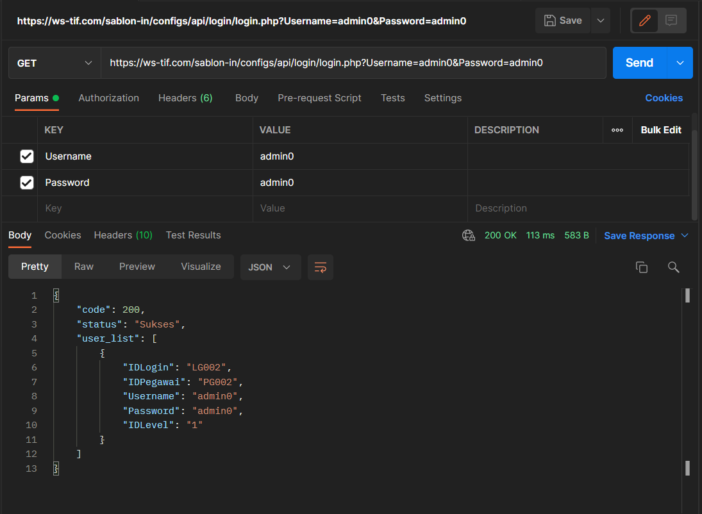

## 📌 API Kelola Barang

### 🔗 Menampilkan Data Barang

- ws-tif.com

```sh
GET : https://ws-tif.com/sablon-in/configs/api/barang/view-barang.php
```

- 000webhost

```sh

```

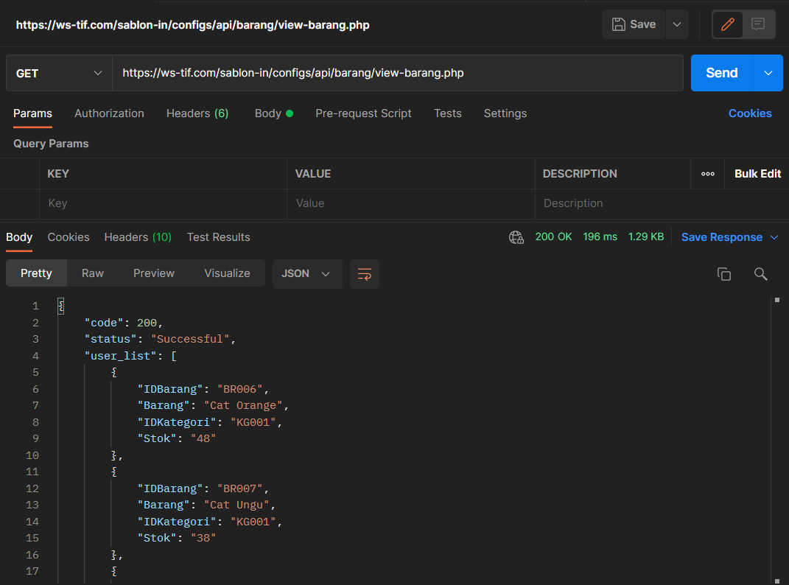

### 🔗 Mengambil Data Barang

- ws-tif.com

```sh
POST : https://ws-tif.com/sablon-in/configs/api/barang/get-barang.php
```

- 000webhost

```sh

```

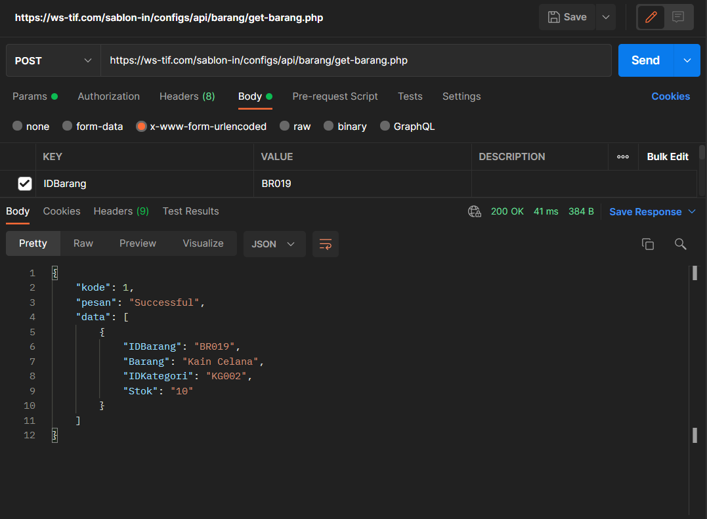

### 🔗 Generate Kode Data Barang

- ws-tif.com

```sh
POST : https://ws-tif.com/sablon-in/configs/api/barang/barang-generate.php
```

- 000webhost

```sh

```

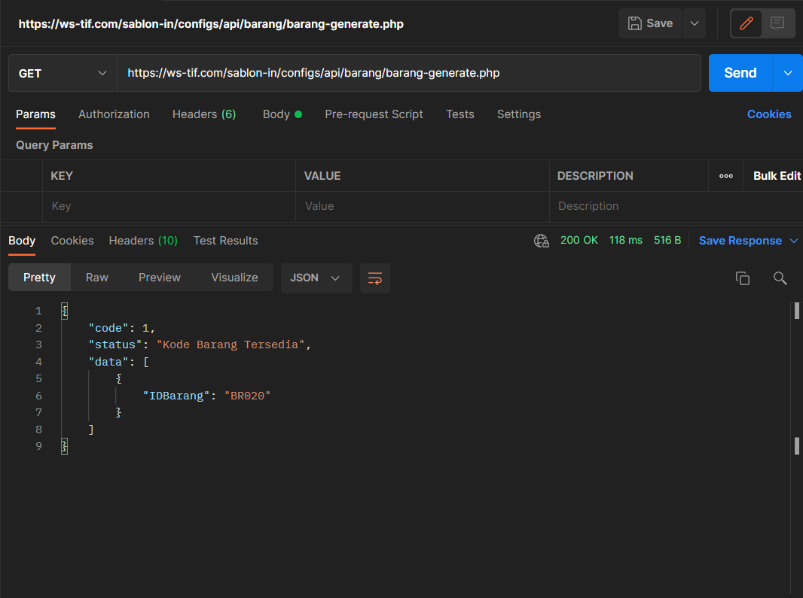

### 🔗 Insert Data Barang

- ws-tif.com

```sh
POST : https://ws-tif.com/sablon-in/configs/api/barang/barang-insert.php
```

- 000webhost

```sh

```

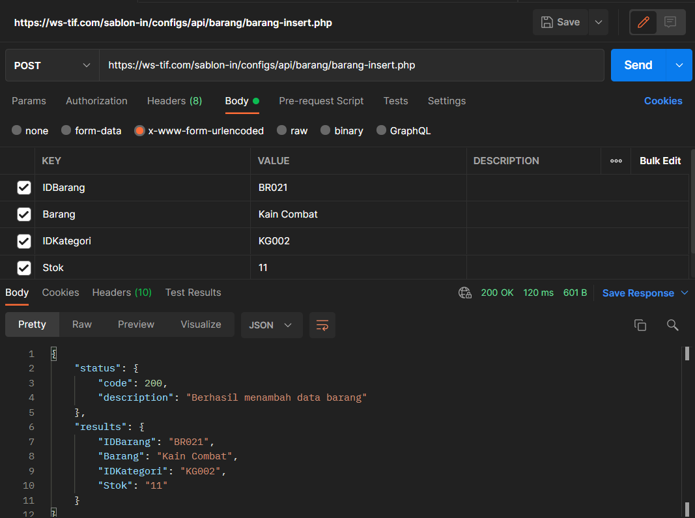

### 🔗 Update Data Barang

- ws-tif.com

```sh
POST : https://ws-tif.com/sablon-in/configs/api/barang/barang-update.php
```

- 000webhost

```sh

```

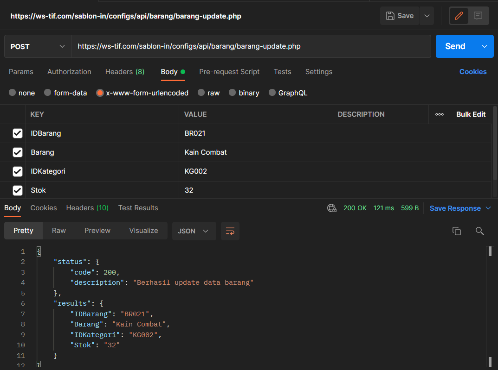

<p align="right">(<a href="#top">Back to top</a>)</p>

## 📌 API Kelola Kategori

### 🔗 Menampilkan Data Kategori

- ws-tif.com

```sh
GET : https://ws-tif.com/sablon-in/configs/api/kategori/view-kategori.php
```

- 000webhost

```sh

```

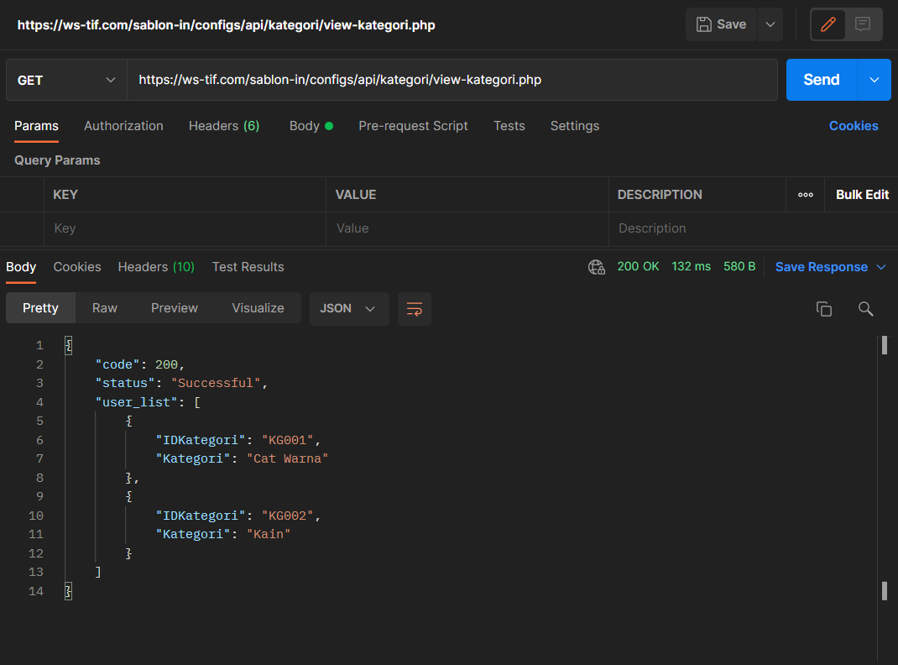

### 🔗 Mengambil Data Kategori

- ws-tif.com

```sh
POST : https://ws-tif.com/sablon-in/configs/api/kategori/get-kategori.php
```

- 000webhost

```sh

```

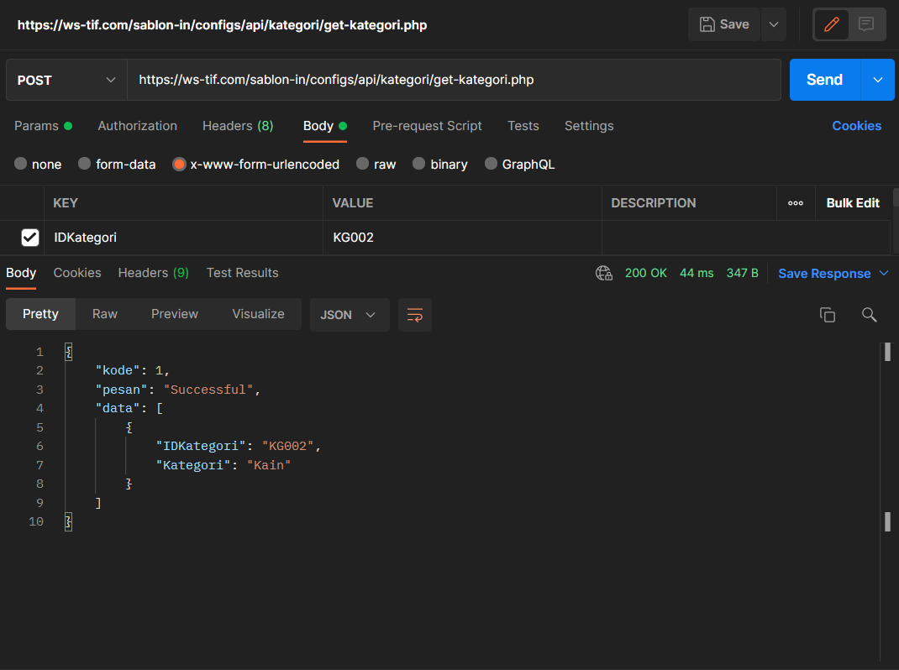

### 🔗 Generate Kode Data Kategori

- ws-tif.com

```sh
POST : https://ws-tif.com/sablon-in/configs/api/kategori/kategori-generate.php
```

- 000webhost

```sh

```

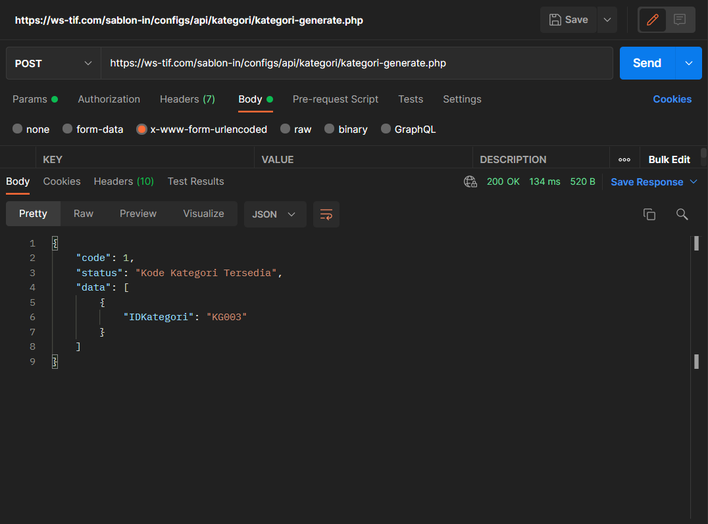

### 🔗 Insert Data Kategori

- ws-tif.com

```sh
POST : https://ws-tif.com/sablon-in/configs/api/kategori/kategori-insert.php
```

- 000webhost

```sh

```

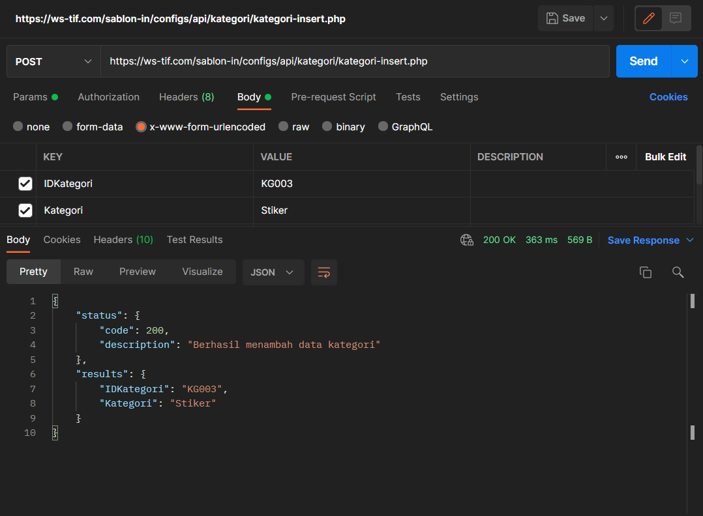

<p align="right">(<a href="#top">Back to top</a>)</p>

## 📌 API Kelola Pegawai

### 🔗 Menampilkan Data Pegawai

- ws-tif.com

```sh
GET : https://ws-tif.com/sablon-in/configs/api/pegawai/view-pegawai.php
```

- 000webhost

```sh

```

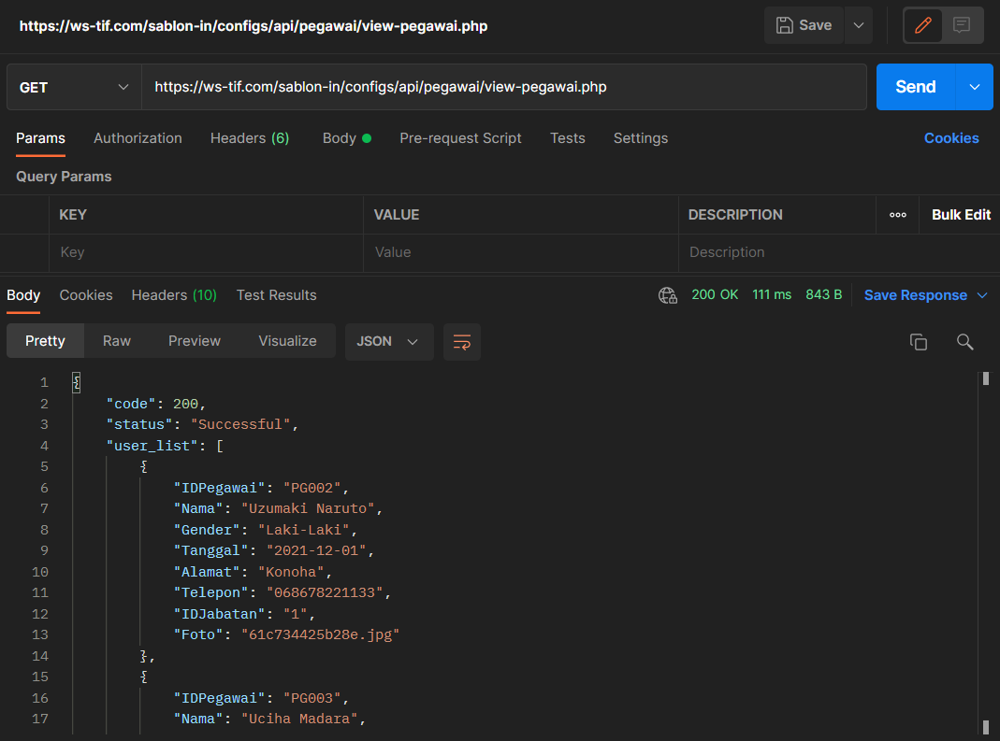

<p align="right">(<a href="#top">Back to top</a>)</p>

## 📌 API Kelola Riwayat

### 🔗 Menampilkan Data Riwayat

- ws-tif.com

```sh
GET : https://ws-tif.com/sablon-in/configs/api/riwayat/view-riwayat.php
```

- 000webhost

```sh

```

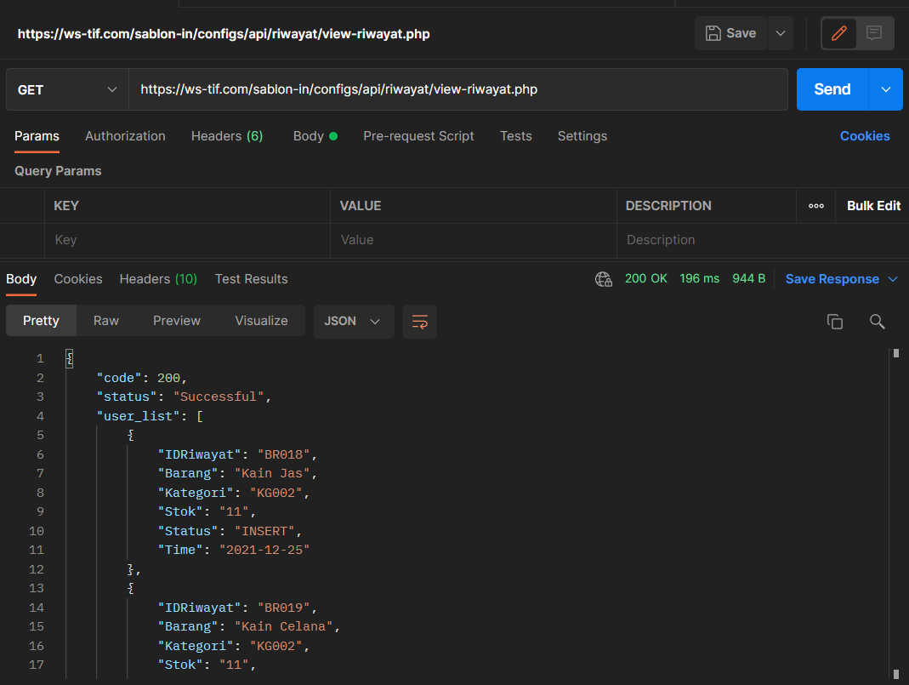

<p align="right">(<a href="#top">Back to top</a>)</p>

## 📌 API Kelola Ulasan

### 🔗 Menampilkan Data Ulasan

- ws-tif.com

```sh
GET : https://ws-tif.com/sablon-in/configs/api/ulasan/view-ulasan.php
```

- 000webhost

```sh

```

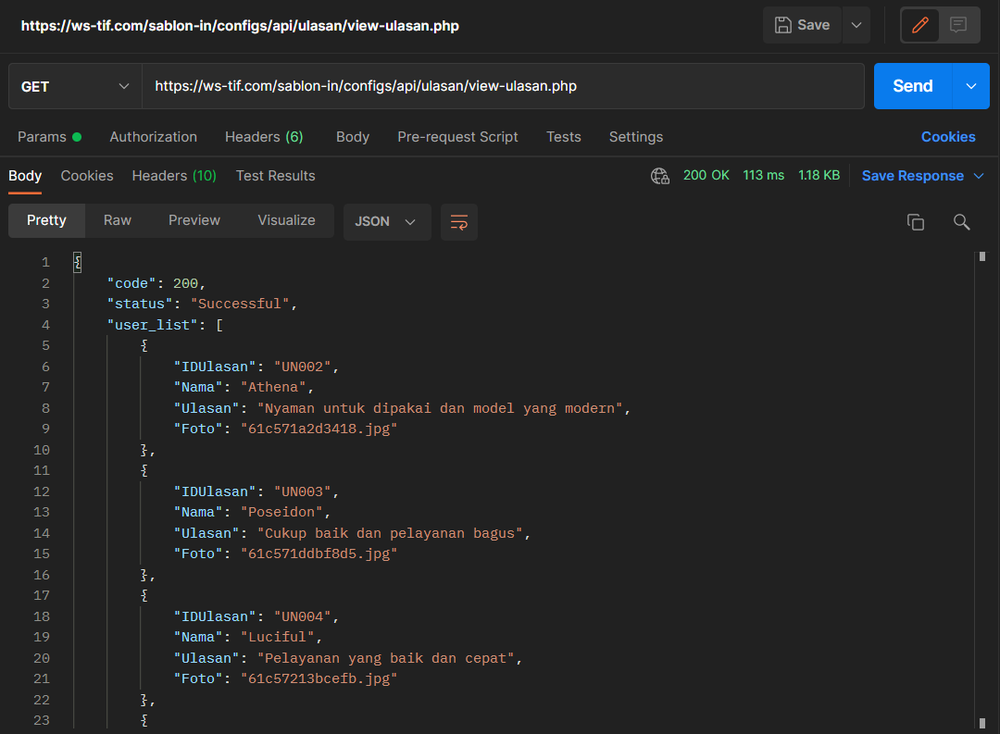

<p align="right">(<a href="#top">Back to top</a>)</p>
## 📌 Built With

Project dibuat dengan menggunakan beberapa software / bahasa pemrograman / framework diantaranya yaitu :

- [PHP 8.0](https://windows.php.net/download)
- [phpMyAdmin 5.1.1](https://www.phpmyadmin.net/)
- [Laragon](https://laragon.org/download/index.html)
- [Postman](https://www.postman.com/)

<p align="right">(<a href="#top">Back to top</a>)</p>

<!-- GETTING STARTED -->

## 📌 Run Project

Project dapat dijalankan dengan cara :

1. Cloning repository project.
2. Import database phpMyAdmin.
3. Jalankan project menggunakan localhost Laragon / Xampp / Postman .

<p align="right">(<a href="#top">Back to top</a>)</p>

<!-- CONTRIBUTING -->

<!-- LICENSE -->

## 📌 License

Project Didistribusikan di bawah MIT License. Silahkan membuka `LICENSE.txt` untuk informasi lebih lanjut.

<p align="right">(<a href="#top">Back to top</a>)</p>

<!-- CONTACT -->

## 📌 Contact

Farul Ahmad Wananda - [Github](https://github.com/farulwananda)

Project Link: [Sablon.in](https://github.com/Sablonin/Sablon.in)

<p align="right">(<a href="#top">Back to top</a>)</p>
